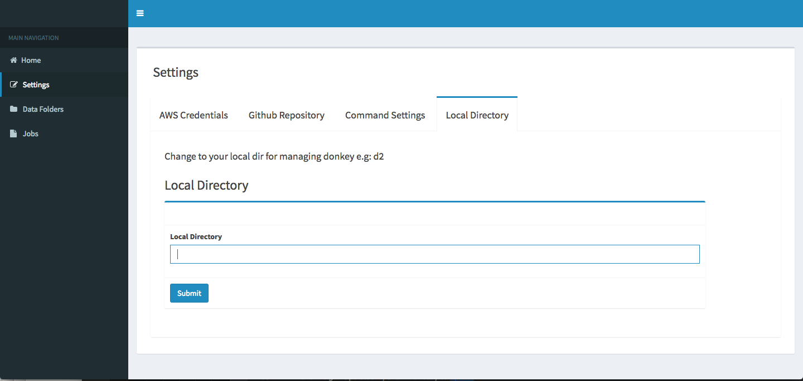
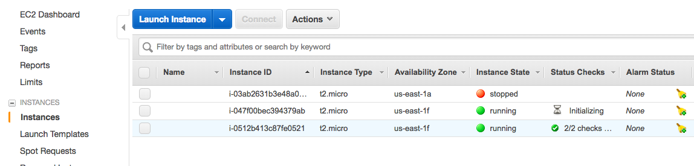

# Donkey Car Console Documentation

## What is Donkey Car Console ?

Donkey Car console is a software deployed on the Pi to facilitate  the use of the car during the phases of driving, training the model and autopilot.

## Demo

This demo can resume how donkeycar console works.

## Why do you want to use Donkey Car Console ?

Thanks to the Donkey Car Console, you  will have a user interface deployed on your pi that helps you manage all the process of turning your car into self-driving. 

## Disclaimer
### security warnings
- Your credentials will be saved in your local database and will be used by our backend server to train your model.
- You are responsible for your own Pi security. If it is compromised you will lose your credentials saved in the local database . 
- You should set a budget limit for your AWS account. 
- We are not responsible for any lost of your AWS credentials. 

## Installation 

    pi@d2:~$ git clone https://github.com/robocarstore/donkeycar-console.git
    pi@d2:~$ cd donkeycar-console/
    pi@d2:~/donkeycar-console$ pip install -r requirements.txt

## Running as a service

- add your hostname to  ALLOWED_HOSTS  in "donkeycar-console/donkeycar-console/settings.py"
- follow these commands :

      pi@d2:~$ sudo apt-get update
      pi@d2:~$ sudo apt-get install supervisor
      pi@d2:~$ sudo nano /etc/supervisor/conf.d/donkeycar-console.conf
      
      
- Copy this :
         
      [program:donkeycar-console]
      command=bash /home/pi/donkeycar-console/donkeycar-console.sh
      autostart=true  
      autorestart=true  
      stderr_logfile=/home/pi/donkeycar-console.err.log
      stdout_logfile=/home/pi/donkeycar-console.out.log
      user=pi  
       
- then :

      pi@d2:~$ sudo service supervisor start
      pi@d2:~$ sudo reboot
      
- open the console with "hostname:8000" (e.g  d2.local:8000). You will see something like this :

#### Note: If you are using the image that supports v.2.5.1 of donkeycar and  before running as a service, you have to :

     pi@d2:~$ sudo nano  donkeycar-console/donkeycar-console.sh

 - change   "source $HOME/.virtualenvs/dk/bin/activate"  with  "source $HOME/env/bin/activate"

#### Note:
if you change the hostname of your car :   
1. Change the hostname in /etc/hostname and /etc/hosts files   
2. You must add the new hostname to ALLOWED_HOSTS in "donkeycar-console/donkeycar-console/settings.py"

## Authentification

This application has a specific authentication mechanism and this  will explain how the user can login to it.
To be authorized to use the lambda functions in the Serverless Project. The user has to have a session and a valid JWT token.

Step1. Creating a Session
Step2. Validating the JWT token

### 1. Creating a session  
Without a session the browser will display a facebook login button.  
When a user press the facebook login button : 
1.1 . The user is asked to authenticate to his facebook account and allow the application to get his public profile. 
1.2 . This action will call the login API in the Serverless project.
1.2 . The API invokes a lambda function to validate the access token using Facebook API. 
1.3. If the access token is valid, the user will be unauthorized to login.  
1.4. If it's valid, the login lambda function will generate a JWT token and send it back to the  Django backend. 
1.5 . The JWT token is stored it in the database. 
1.6 . A session is created and now the user is authorized to login to the application. 

After creating a session, the user will be redirected to the home page of the DonkeyCar console application but he will not be able to invoke the rest of the lambda functions until the JWT token is validated and that will be explained in the second step. 
### 2. Validating the JWT token  
Now the user is redirected to home page but if he want to enquire about the number of credits he have. His JWT token must be verified. 
2.1. The Django backend will call any serverless function with passing the stored JWT token as a parameter. 
2.2. An authorize lambda function will be invoked to verify if the JWT token is valid or not. 
2.3.  If the JWT token is valid, the second step is verified and the lambda function will send the result to the user. 
2.4. If it's not valid, the user will be unauthorized to call the lambda function from the Serverless project. 

After those two steps are verified, the user will have the ability to use the DonkeyCar console and the functions in the Serverless project. 

## How to set up the donkey car console settings ?

#### 1 : Set up your AWS credentials in the settings page:

The donkey car console won't enable you to use its features if you don't set up your AWS credentials . In fact, our backend server will use those credentials to train your model and make it ready to use.

#### Important : After you set up your credentials you have to grant some permissions so our backend server can work perfectly :

- AmazonEC2FullAccess
- AmazonS3FullAccess

To grant permission you can have a look on https://docs.aws.amazon.com/IAM/latest/UserGuide/id_users_change-permissions.html

#### Note: if you don't have an amazon account you can visit this link https://aws.amazon.com/resources/create-account/ and create one.

#### 2 : Set up your Github Repository in the settings page:
You have to specify the Github repository you want to use to train your model  and choose the model extension.
In fact, some Github repositories  require a specific extension in the model name.

After setting up your AWS credentials and the Github repository you want to use to train your model , you can specify which way you want your car to be driven.

#### 3. Manage your commands in the settings page:

The driving command by default is "python manage.py drive" 
if you add in the settings page ' - js' the command executed will be "python manage.py drive  - js " and you can use your PS3 controller to drive the car.

#### 4. Set up your local directory in the settings page:

You can specify the name of your local directory  for managing donkey 'e.g: d2'

##  How to collect data ?

### 1.  Drive and collect Data :
You can start driving your car to collect data in the home page.
The page will display the state of the car if it is driving or not and you can start and stop driving using two buttons. Moreover, the collected data will be stored in the local directory of the donkey car.

### 2. Check the data folders:

In the data folders page, you can find all the collected data and the saved folders in the local directory,  the name, the number of images and the creation time of each folder.
You can save some remarks for each folder , download it to make sure of its content or delete it.

## How to start a job and train your model ?

Once you collect data, you can start a job to train your model.  
To start a new job, you select "ADD JOB" in the jobs page.  
A new page will be displayed and you can select which data you want to train with and fill  out the form for the creation of the EC2 instance.  
#### EC2 Instance Type :
The type of the spot instance you want to start the job with.  
#### Availability Zone : 
Once you select the type of the instance a list of the available zones will be displayed with the price of each one per hour.  
#### Ec2 Termination Time:
You can specify the termination time of your spot instance. In fact, the instance will terminate itself after this time even if the model is not created yet. 
#### Spot Request Time:
If you submit a job, a request is sent to create a spot instance with the specified parameters. If this request is not fulfilled within this time, it will be canceled. 

You can check the jobs page that will display  all the needed informations of your started jobs. 
Each job will be identified by :

- **Id** : This id will help us identify the model once it's created.

- **Data Size** : this is the size of the selected data to train the model with.

- **Tubs**: the list of the folders selected to train with.

- **Starting Time** : the time you started the job.

- **Training Duration** : the time taken to train and create a model.

- **State** : the state of the started job and it can take 4 values : Pending , Finished ( the model is trained and created successfully ) , Failed and Canceled.

- **Request State**: once you start a job, a request is sent to launch a spot EC2 instance to train the model. you can verify what is the state of the request in this column.

- **Instance Type - AZ** : this column is for the selected type of instance and its availability zone.

- **Price** : the price of the selected EC2 instance per hour 

- **Size** : the size of the model once it's created.

- **Remarks**: you can save some remarks related to the created model.

- **Autopilot**: if the job is finished successfully a button will appear to indicate that you can start the autopilot mode using this model.

- **Actions** : you can delete the job , cancel it , and download its logs. You have two different logs : "Training Logs" shows the process of training the model and "Commands Logs" is the responsible for showing the commands executed in the EC2 instance.

- **Update**: this button will help you update the state of the  job and check if the a model is successfully created or not.

## Troubleshooting

To troubleshoot and make sure that your request is fulfilled and your  spot instance is created :

Those are the steps you should do :

1 -  Open the Amazon EC2 console at https://console.aws.amazon.com/ec2/   
2 -  Choose Spot Requests.  
3 -  You have to find something like this :

4 - And you can check Instances and see your instance running.

 

